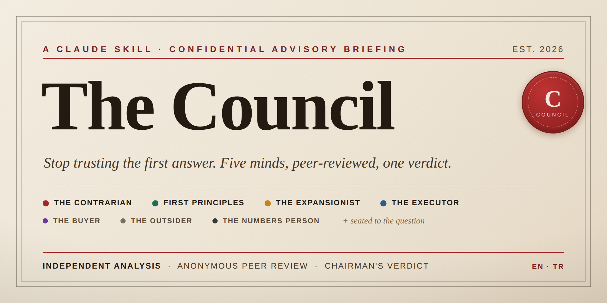

<p align="center">
  
</p>

# The Council — A Claude Skill

Stop trusting the first answer you get. Run any real decision through a panel of AI advisors who think from genuinely different angles, tear each other's reasoning apart anonymously, and hand you back a verdict that names exactly where they agree, where they clash, *why* they clash, and what you should do Monday morning.

Adapted from [Andrej Karpathy's LLM Council](https://x.com/karpathy/status/1962263486196867115) methodology — extended with a situational advisor pool, adversarial peer review, decision-evolution tracking, full bilingual (EN/TR) support, and an editorial-grade HTML briefing.
MCW AJANS - EMRE ÖZTÜRK Tarafından mevcut yapı geliştirilmiştir.

---

## The Problem

A single AI is agreeable to a fault. Ask it "should I launch this?" and it finds five reasons you should. Ask "is this a bad idea?" and it finds five reasons it is. Same idea, opposite framing, opposite answer.

That's harmless when you're drafting an email. It's expensive when you're making a decision that's hard to reverse — pricing, pivots, hiring, positioning, build-vs-buy.

The Council exists for exactly those moments: when being wrong costs real money, time, or momentum, and you need more than one mind that's afraid to disagree with you.

---

## How It Works

When you trigger it, the skill runs a full session in a single pass:

1. **Scans your workspace for context.** It reads the 2–3 files that actually sharpen the advice — `CLAUDE.md`, any `memory/` docs, files you referenced, and **prior council transcripts** so it can track how your thinking has evolved.
2. **Frames your question** into one neutral prompt every advisor receives — no steering, no leading.
3. **Seats the right advisors for the question.** Not the same five every time. Four are always present; the rest are chosen from a situational pool based on what the decision actually involves.
4. **Convenes the council in parallel.** Every advisor answers independently and is forced to surface the one load-bearing assumption their view depends on.
5. **Runs an adversarial, anonymized peer review.** Advisors review each other as "Response A, B, C…" — randomized, so no one defers to a name. They hunt for the response most likely to cause a *bad* decision and name the hidden assumptions underneath each clash.
6. **Chairman synthesizes the verdict** — agreement, clashes traced to their root, blind spots caught only in review, a direct recommendation (the chairman is allowed to side with the dissenter, or to say "not enough info" and name the one fact that would unlock it), and a single concrete first step.
7. **Generates an editorial HTML briefing** + a full markdown transcript.

About four minutes. One session.

---

## What Makes This Version Different

This is not the stock five-advisor build. It's been extended in several ways:

**A seven-lens advisor pool, seated to the question.** The four foundational tensions are always present. The remaining seats are filled situationally — a pricing call gets the Buyer and the Numbers Person; a positioning call gets the Buyer and the Outsider. You get the advisors the decision needs, not a fixed template.

**Adversarial peer review.** The review step doesn't ask "what's good here." It asks which response is most likely to lead you to a *bad* decision and what's wrong with its reasoning — and forces reviewers to name the hidden assumption underneath each disagreement.

**Clashes traced to their root.** The signature output. Instead of a balanced "on one hand / on the other," the chairman reduces each disagreement to the single resolvable question underneath it: *resolve THIS and the decision becomes clear.*

**Decision-evolution tracking.** Council the same question twice and it reads the prior transcript, then tells you what changed and whether your latest moves actually resolved the earlier clash.

**Full bilingual support (English + Turkish).** Trigger it in Turkish and the entire session — every advisor, the peer review, the verdict, and the HTML report — runs in Turkish, advisor names localized naturally (Muhalif, Kök Neden, Genişlemeci, Uygulayıcı…). No language mixing.

**An honest stance on independence.** By default all advisors are one model wearing different hats, and the skill says so plainly rather than overselling "five independent minds." An optional multi-model mode routes seats to other models for genuine independence when you ask for it.

**An editorial HTML briefing** — warm paper, serif body, an agreement/clash ledger, an advisor alignment spectrum, and the root-of-the-clash callout as the centerpiece. It reads like a confidential one-page memo, not a generic dashboard.

---

## The Advisor Pool

**Core four (always seated):**

- **The Contrarian** — hunts for what's wrong, what's missing, what will fail. Assumes a fatal flaw exists and tries to find it.
- **The First Principles Thinker** — ignores the surface question and asks what you're *actually* trying to solve. Sometimes the answer is "you're asking the wrong question."
- **The Expansionist** — looks for the upside everyone else is missing. What if this works better than expected?
- **The Executor** — only cares whether it can be done and what the fastest path is. "OK, but what do you do Monday morning?"

**Situational pool (1–2 seated based on the question):**

- **The Buyer / Counterparty** — the most underrated seat. Thinks as the person on the *other side*: the customer who'd pay, the hire who'd join, the partner who'd sign. Asks "why would I actually say yes — and what makes me walk away?"
- **The Outsider** — zero context, reacts only to what's in front of them. Catches the curse of knowledge: things obvious to you, confusing to everyone else.
- **The Numbers Person** — refuses any claim without quantifying it. Unit economics, realistic conversion rates, break-even, opportunity cost in dollars and hours.

**Quick seating guide:**

| Decision type | Seat these |
|---|---|
| Pricing / offer / launch | Buyer + Numbers Person |
| Positioning / messaging / naming | Buyer + Outsider |
| Build vs. buy / hire vs. automate | Numbers Person + Executor-heavy framing |
| Strategic pivot | Outsider + Numbers Person |
| "Am I crazy?" gut-check | Contrarian + Buyer |

---

## Install

### Option 1 — Git clone (recommended)

```bash
git clone https://github.com/eskisehirdurum/the-council-skill ~/.claude/skills/the-council
```

Then open Claude Code (`claude` in your terminal). The skill is picked up automatically.

### Option 2 — Manual

1. Create the folder `~/.claude/skills/the-council/`
2. Drop `SKILL.md` inside it
3. Restart Claude Code

---

## Use

Type any trigger followed by your question.

**English triggers:**
- `council this`
- `run the council`
- `pressure-test this`
- `stress-test this`
- `war room this`
- `debate this`

**Turkish triggers:**
- `konseyi topla`
- `konseye sor`
- `bunu masaya yatır`
- `baskı testi yap`

**Example:**

> council this: I'm thinking of pivoting from a $297 course to a $97 live workshop for an audience of non-technical solopreneurs. Is that the right move?

The richer your input, the sharper the output. Give it context — constraints, numbers, what you've already tried.

You'll get back:
- An editorial **HTML report** that opens automatically
- A full **markdown transcript** saved alongside it

For lower-stakes calls, ask for the lighter **3-advisor** version — it skips straight to the core tensions.

---

## When To Use It

**Good council questions:**
- "Should I launch a $97 workshop or a $497 course?"
- "Which of these three positioning angles is strongest?"
- "I'm thinking of pivoting from X to Y. Am I crazy?"
- "Here's my landing page copy. What's weak?"
- "Should I hire a VA or build an automation first?"

**Skip the council for:**
- Factual questions with one right answer ("what's the capital of France?")
- Pure creation tasks ("write me a tweet")
- Summaries and processing tasks
- Validation-seeking when you already know the answer

The council tells you things you don't want to hear. That's the feature, not the bug.

---

## Output

Every session produces two files in your working directory:

```
council-report-[timestamp].html     # the visual briefing, opens automatically
council-transcript-[timestamp].md    # full transcript — read by future runs to track evolution
```

The transcript includes the original question, the framed prompt, the seating choice and why, every advisor response, every peer review (with the anonymization mapping revealed), and the chairman's full synthesis.

---

## Optional: Real Multi-Model Mode

By default, every advisor is the same underlying model in a different role — which means they share some blind spots no role assignment fully removes. The peer review and adversarial framing exist to claw back as much real independence as possible.

If you want *genuinely* independent advisors and have API access, you can route 2–3 seats to other models, either in-session via the API or by generating copy-pasteable prompt blocks you run elsewhere and paste back. It's slower, but it's the version closest to Karpathy's original and it materially reduces shared blind spots. Just ask for it.

## License

MIT — do whatever you want with it.
